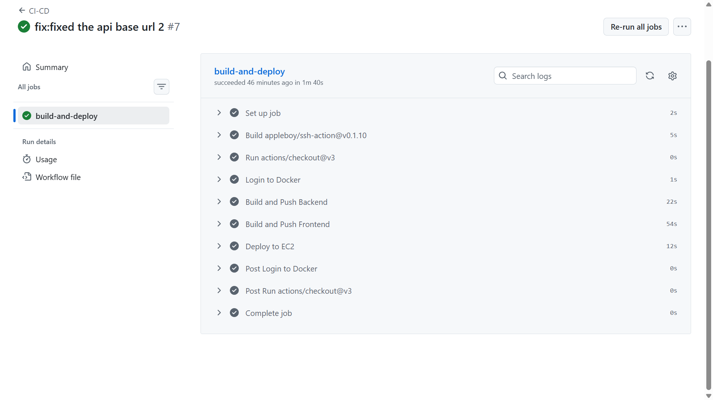
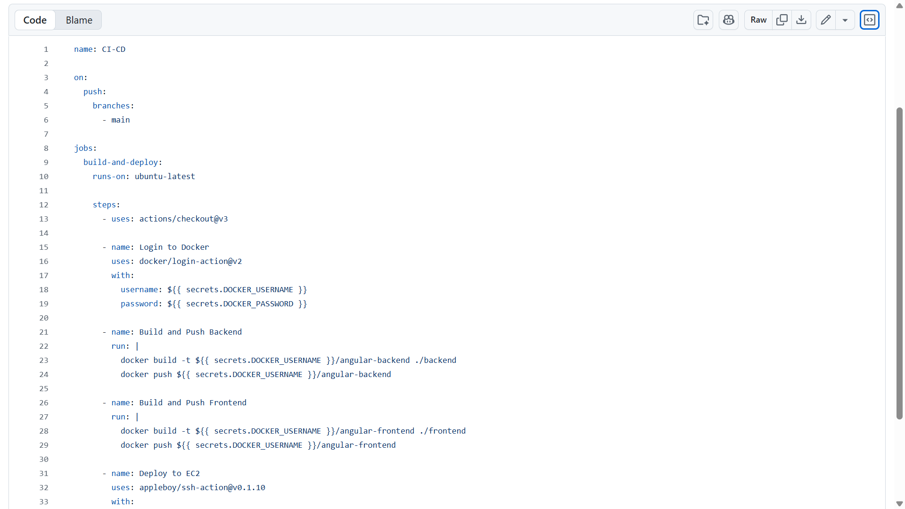
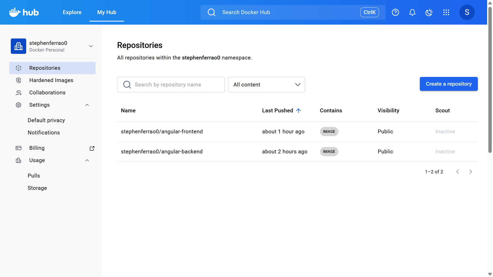
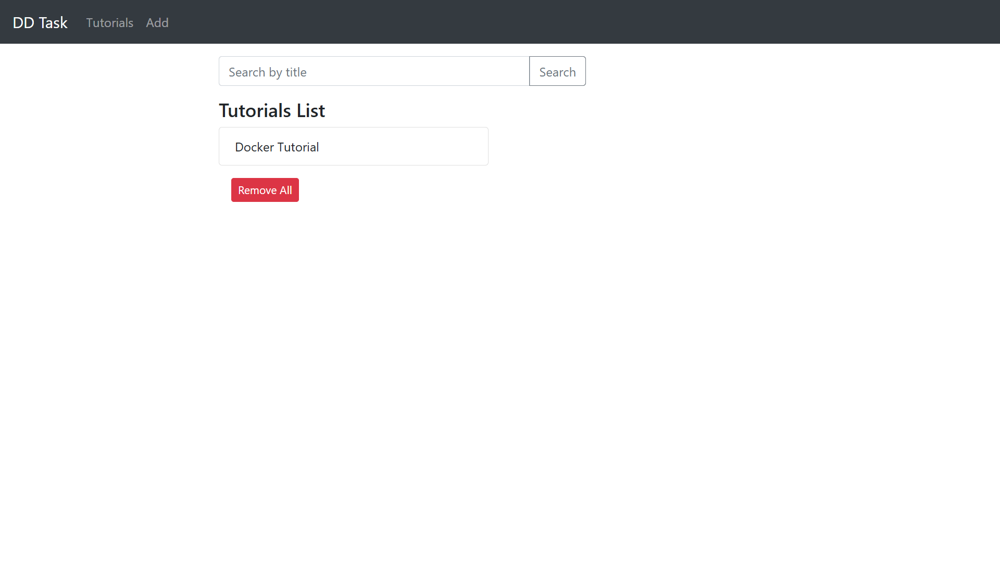
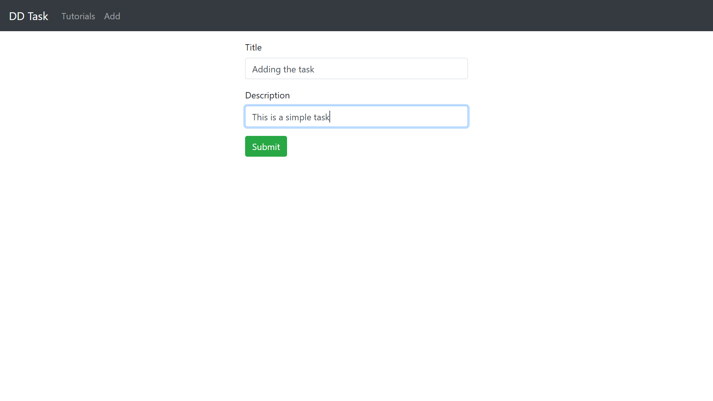
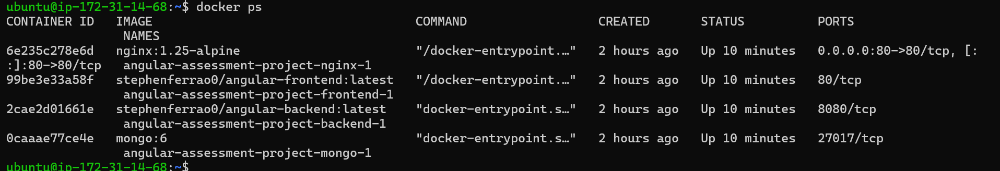
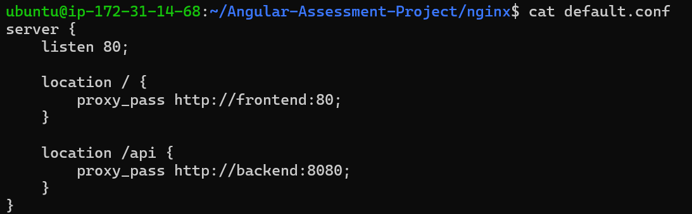
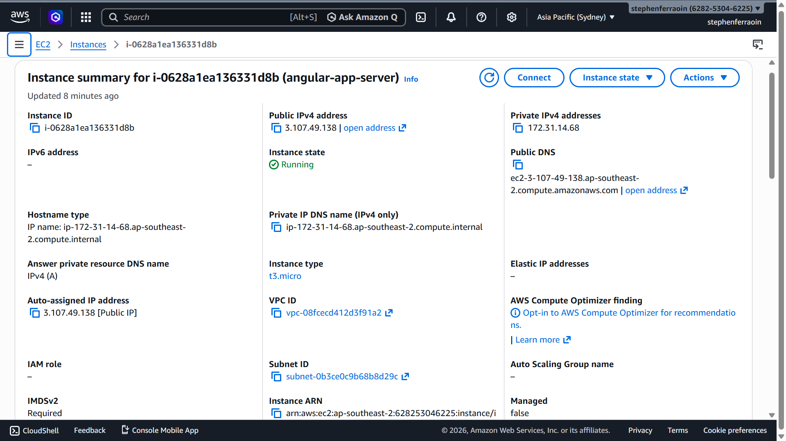

# DevOps Assessment Submission


> A fully containerized, CI/CD-enabled web application deployed on a cloud VM with Nginx reverse proxy and MongoDB backend.

---

## Table of Contents

1. [Tasks Completed](#1-tasks-completed)
2. [Deliverables Included](#2-deliverables-included)
3. [Deployment Steps](#3-deployment-steps)
4. [Screenshots](#4-screenshots)
5. [Repository Link](#6-repository-link)

---

## 1. Tasks Completed

| Task | Description |
|------|-------------|
| **Repository Setup** | Source code structured in a GitHub repository with all configuration files, environment definitions, and application code committed. |
| **Containerization & Deployment** | Application containerized using Docker; multi-service orchestration handled via Docker Compose. |
| **Database Setup** | MongoDB deployed as a Docker container with persistent volume storage configured. |
| **CI/CD Pipeline** | Automated pipeline via GitHub Actions (or Jenkins) — triggers on push to `main`, builds and pushes Docker images to Docker Hub. |
| **Nginx Reverse Proxy** | Nginx configured as a reverse proxy on port 80, routing all external traffic to the application container. |

---

## 2. Deliverables Included

```
repository/
├── Dockerfile                    # Application container build definition
├── docker-compose.buil.yml
├── docker-compose.prod.yml         
├── .github/workflows/ci-cd.yml   # GitHub Actions pipeline (or Jenkinsfile)
├── nginx/
│   └── nginx.conf                # Nginx reverse proxy configuration
└── src/                          # Complete application source code
```

---

## 3. Deployment Steps

### Step 1 — Clone the Repository

```bash
git clone https://github.com/Stephenferrao20/Angular-Assessment-Project.git
```

### Step 2 — Start All Services

```bash
docker compose -f docker-compose.prod.yml up -d --build
```

### Step 3 — Access the Application

Open your browser and navigate to:

```
http://<VM_PUBLIC_IP>
```

> Replace `<VM_PUBLIC_IP>` with the public IP address of your cloud VM. The application runs on **port 80** via the Nginx reverse proxy.

---

## 4. Screenshots

### 4.1 CI/CD Pipeline Configuration & Execution





---

### 4.2 Docker Image Build & Push to Docker Hub



---

### 4.3 Application Deployment & Working UI




---

### 4.4 Nginx Reverse Proxy Setup



---

### 4.5 Infrastructure / VM Setup



---

## 5. Repository Link

**GitHub:** [View Repository](<https://github.com/Stephenferrao20/Angular-Assessment-Project.git>)
